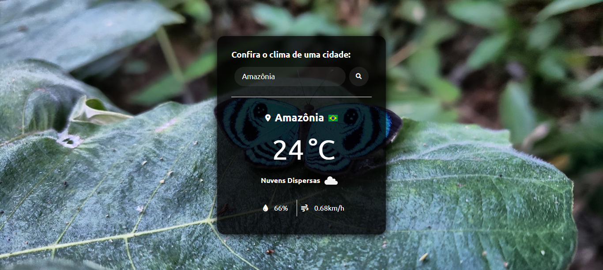

  

# Weather Today

## Tecnologias
Esse projeto foi desenvolvido com as seguintes tecnologias:

HTML, CSS 
JavaScript (DOM)
API's

## 💻 Projeto
O WeatherToday é um projeto que simula o clima de um Estado e País em tempo real, onde é possível adicionar qualquer lugar do mundo!

## 🔖 Layout
Você pode visualizar o layout do projeto através DESSE LINK. 

## 📝 Licença
Esse projeto está sob a licença ValerioBruna.

Feito com ♥